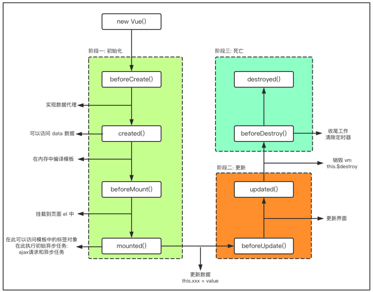

# 认识vue

Vue有很多特点和Web开发中常见的高级功能

* 解耦视图和数据
* 可复用的组件
* 前端路由技术
* 状态管理
* 虚拟DOM


什么是响应式

当数据发生改变，界面会发生自动发生相应，会自动更改。


# 插值语法

## v-for

```html
<!DOCTYPE html>
<html lang="en">
<head>
    <meta charset="UTF-8">
    <meta http-equiv="X-UA-Compatible" content="IE=edge">
    <meta name="viewport" content="width=device-width, initial-scale=1.0">
    <title>Document</title>
</head>
<body>
    <div id="app">
        <ul>
            <li v-for="item in movies">{{item}}</li>
        </ul>
    </div>
    
</body>
<script src="./resource/js/vue.js"></script>

<script>

    const app = new Vue({
        el:"#app",
        data:{
            message:"hello world",
            movies:["海王","星际穿越","复仇者联盟","盗梦空间"]
        }
    })
</script>
    
    实际上渲染的是会把movies变成列表
    <ul style="">
        <li">海王</li>
        <li>星际穿越</li>
        <li>复仇者联盟</li>
       <li>盗梦空间</li></ul>
            
            
      最重要的是他是相应式的，movies里面的数据有变更，ul里面的li也会变更
</html>

```


vue是mvvm的一个架构

mvvm

model view view-model

ViewModel，V与M连接的桥梁，也可以看作为控制器


定义：view对于的是我们的dom，model的话，对应我们的数据. viewmodel的话，相当于我们的vue。

作用：如果你现在这个view和我们的model直接想要通信，他们两个之间能直接通信吗？

不能，要通过我们的viewmodel，它帮助我们做了两件事情，

1. 第一件事情，就是data-bindings,

数据绑定。model（js）里面定义的有很多数据，这个viewmodel可以把model里面的数据，绑定到真实dom（view）上面。

刚才我们就通过mustache语法，给他绑定到view里面。而且，我们在绑定的时候，

你写这个viewmodel的具体语法就可以，到时候这个viewmodel它会帮你解析，把这些真是的数据

解析出来，它解析出来的话，给我们更新到界面上。

所以它的第一个操作，就是把我们的data更新到界面上，vue是响应式，自动检测到model里面数据的改变，把最新的数据再重新绑定到view上面。

所以view上面永远显示的是model上面最新的数据，就是viewmodel帮我们做了这个事情。


2. 第二个事情，就是dom listener

就是dom监听。就是当我们view上面有一些事件或者有用户操作的话，viewmodel会我们dom做一些监听，把事件相关的东西绑定到model上面。

计数器的案例，当点击的时候，通过v-on：click这一个指令，这是viewmodel自己定义的一个指令。它会通过v-on这个指令，把它绑定到我们model上面，它会我们dom做一些监听，你可以写一些js代码，比如methods里面，定义一些函数，把它绑定到我们的函数里面，所以你一旦view发生点击之后的或，这个viewmodel他会监听到这个dom的响应的，他会来回调我们刚刚再methods里面定义的那些函数。


所以viewmodel最主要就是做这两件事情。

第一个叫做data bindings,把我们model上的数据绑定到这个dom（view）上面，

另一个是界面上发生一些事情，发生一些用户操作的时候，再把这些定义的东西（js代码），把它回调到我们这个javascipt里面的对象（model），着我们这个案例里面，就是刚才这个methods定义的函数里面，他就会回调这些函数，你就可以再这个函数里面做更多的这个操作了。


```js
//以上的代码，可以把data里面的counter提取出来

const obj = {

counter : 0;

}//这个是model层

const app = new Vue({

el:"#app",

data:obj,

})
```


## 1. 创建Vue实例传入的options


[API — Vue.js (vuejs.org)](https://cn.vuejs.org/v2/api/#选项-数据)

目前掌握这些选项：
el: 
类型：string | HTMLElement
作用：决定之后Vue实例会管理哪一个DOM。
data: 
类型：Object | Function （组件当中data必须是一个函数）
作用：Vue实例对应的数据对象。
methods: 
类型：{ [key: string]: Function }
作用：定义属于Vue的一些方法，可以在其他地方调用，也可以在指令中使用。

## 2. Vue的生命周期





## 3. 模板语法

### 3.1 插值操作

插值操作就是在data里面定义了数据，希望把数据插入到dom里面的content进行显示操作。

#### 1.使用Mustache语法(也就是双大括号)。

  我们可以像下面这样来使用，并且数据是响应式的

```html
<body>
  <div id ="app">
    <h2>{{message}}</h2> //你好啊
    <h2>{{message}},李银河</h2>//你好啊,李银河
    <!-- mustache语法中，不仅仅可以直接写变量，也可以写简单的表达式 -->
    <h2>{{firstName + ' '+lastName}}</h2>//mr right
    <h2>{{firstName}} {{lastName}}</h2>//mr right
    <h2>{{counter * 2}}</h2>//200
  </div>

  <script>
   var app = new Vue({
    el: '#app',
    data: {
      message: '你好啊',
      firstName: 'mr',
      lastName: 'right',
      counter: 100
    },
    methods: {}
   });
  </script>
</body>

```


#### 2.v-once

但是，在某些情况下，我们可能不希望界面随意的跟随改变
这个时候，我们就可以使用一个Vue的指令
v-once: 
该指令后面不需要跟任何表达式(比如之前的v-for后面是由跟表达式的)
该指令表示元素和组件(组件后面才会学习)只渲染一次，不会随着数据的改变而改变。只会在第一次改变message的数据。

```html
<body>
  <div id ="app">
    <h2>{{message}} </h2>
    <h2 v-once>{{message}}</h2>
    <!-- 在控制台输入app.message = 'HEllo!' 之后，只有第一个h2的内容变换，第二个没有 -->
  </div>

  

    <!-- 
      在某些情况下，我们可能不希望界面随意的跟随改变
      这个时候，我们就可以使用一个Vue的指令
      v-once: 
      该指令后面不需要跟任何表达式(比如之前的v-for后面是由跟表达式的)
      该指令表示元素和组件(组件后面才会学习)只渲染一次，不会随着数据的改变而改变。

      v-once只是一个简简单单的指定，后面没有表达式
    -->

  <script>
   var app = new Vue({
    el: '#app',
    data: {
      message: '你好啊'
    },
    methods: {}
   });
  </script>
</body>
```

#### 3. v-html


```html

<body>
  <div id="app">
    <h2>{{url}}</h2>//<a href="https:www.baidu.com">百度一下</a>
    <h2 v-html="url"></h2>//百度一下
  </div>

  <script>
    var app = new Vue({
      el: '#app',
      data: {
        message: '你好啊',
        url: '<a href="https:www.baidu.com">百度一下</a>'
      },
      methods: {}
    });
  </script>


<!-- 
1. 某些情况下，我们从服务器请求到的数据本身就是一个HTML代码
  (1)如果我们直接通过{{}}来输出，会将HTML代码也一起输出。
  (2)但是我们可能希望的是按照HTML格式进行解析，并且显示对应的内容。
2. 如果我们希望解析出HTML展示
  (1)可以使用v-html指令
    a.该指令后面往往会跟上一个string类型
    b.会将string的html解析出来并且进行渲染
 -->
</body>
```


#### 4. v-text

v-text作用和Mustache比较相似：都是用于将数据显示在界面中
v-text通常情况下，接受一个string类型

```html
<body>
  <div id="app">
    <h2>{{message}}, 李银河</h2>
    <h2 v-text="message">, 李银河</h2>
  </div>

  <script>
    var app = new Vue({
      el: '#app',
      data: {
        message: '你好啊'
      },
      methods: {}
    });
  </script>
</body>

<!-- 

  1. v-text作用和Mustache比较相似：都是用于将数据显示在界面中
  2. v-text通常情况下，接受一个string类型
  3.缺点是会把标签里面的内容覆盖（, 李银河），用起来不灵活

第一个显示的是：你好啊, 李银河
第二个显示的是：你好啊
 -->
```


#### 5. v-pre

v-pre用于跳过这个元素和它子元素的编译过程，用于显示原本的Mustache语法。
比如下面的代码：
第一个h2元素中的内容会被编译解析出来对应的内容
第二个h2元素中会直接显示{{message}}

```html
<body>
  <div id="app">
    <h2>{{message}} </h2><!-- 你好啊 -->
    <h2 v-pre>{{message}} </h2><!--{{message}}  -->
    <!-- 原封不动地把标签里面的内容显示出来，不要做任何解析 -->
  </div>

  <script>
    var app = new Vue({
      el: '#app',
      data: {
        message: '你好啊'
      },
      methods: {}
    });
  </script>
</body>
<!-- 

v-pre用于跳过这个元素和它子元素的编译过程，用于显示原本的Mustache语法。
比如下面的代码：
第一个h2元素中的内容会被编译解析出来对应的内容
第二个h2元素中会直接显示{{message}}

 -->
```


#### 6. v-cloak

在某些情况下，我们浏览器可能会直接显然出未编译的Mustache标签。把指令当成属性，添加在标签里面
cloak: 斗篷

```html
<!DOCTYPE html>
<html lang="en">

<head>
  <meta charset="UTF-8">
  <meta name="viewport" content="width=device-width, initial-scale=1.0">
  <meta http-equiv="X-UA-Compatible" content="ie=edge">
  <title>Document</title>
  <script src="./resource/js/vue.js"></script>
  <style>
    [v-cloak]{
      display: none;
    }
  </style>
</head>
<!-- cloak : 斗篷 -->
<body>
  <div id="app" v-cloak>
    {{message}} 
  </div>

  <script>
    /* 
    在vue解析之前，div中有一个属性v-cloak
    在vue解析之后，div中没有一个属性v-cloak
    所以在vue没有解析之前，对于有v-cloak属性的元素，设置css，display为none
    */
    setTimeout(function(){
      var app = new Vue({
      el: '#app',
      data: {
        message: '你好啊'
      },
      methods: {}
    });
      
    }, 3000);
    /*
    让Vue在3秒之后再创建，3s以前，界面上应该显示的就是{{message}}，但是因为添加了v-cloak，所以是css作用，变成不显示。
    ，执行过程中js卡住的话，3s之后 {{message}} 变成了'你好啊'，我们不希望用户看到 {{message}}*/

      
      
  属性选择器[]
      如果您希望把包含标题（title）的所有元素变为红色，可以写作：

[title] {color:red;}
  </script>
</body>

</html>
```


### 3.2 绑定属性

前面我们学习的指令主要作用是将值插入到我们的文本里面

比如

```html
<div id="app">{{message}} </div>
```

如果我们想绑定数据到标签的属性里面呢？

但是，除了内容需要动态来决定外，某些属性我们也希望动态来绑定。

比如动态绑定a元素的href属性
比如动态绑定img元素的src属性
这个时候，我们可以使用v-bind指令：
作用：动态绑定属性
缩写：:
预期：any (with argument) | Object (without argument)
参数：attrOrProp (optional)

#### 1. v-bind基础

v-bind用于绑定一个或多个属性值，或者向另一个组件传递props值
在开发中，有哪些属性需要动态进行绑定呢？
还是有很多的，比如图片的链接src、网站的链接href、动态绑定一些类、样式等等
比如通过Vue实例中的data绑定元素的src和href，代码如下

```html

<body>
  <div id ="app">
    <!-- 这里不希望把img的src写死，让它动态决定 ，一般都是服务器请求的数据放到data里面，在通过语法，动态绑定到img-->
    <!-- mustache语法是在元素的content里面使用的，在src里面是不能使用的 -->
  <!--  --><!--    直接把{{url}}当成字符串处理-->
<!-- 正确做法，使用v-bind指令，给哪个元素绑定值，就给哪个元素前绑定v-bind -->

<a v-bind:href="urllink">百度一下</a>


<!-- 语法糖

v-bind有一个对应的语法糖，也就是简写方式
在开发中，我们通常会使用语法糖的形式，因为这样更加简洁
-->


<a :href="urllink">百度一下</a>


  </div>

  <script>
   var app = new Vue({
    el: '#app',
    data: {
      message: '你好啊',
      url:'https://pics6.baidu.com/feed/3801213fb80e7becc074555394cc743099506bc5.jpeg?token=ac20efff0f7d298d5534bd55d6ee8081',
      urllink:'https://wwww.baidu.com'
    },
    methods: {}
   });
  </script>
</body>
```

#### 2. v-bind绑定class（一）

很多时候，我们希望动态的来切换class，比如：
当数据为某个状态时，字体显示红色。
当数据另一个状态时，字体显示黑色。
绑定class有两种方式：

1. 对象语法
2. 数组语法

#### 3. v-bind绑定class（二）

绑定方式：对象语法
对象语法的含义是:class后面跟的是一个对象。
对象语法有下面这些用法：

```html
用法一：直接通过{}绑定一个类
<h2 :class="{'active': isActive}">Hello World</h2>

用法二：也可以通过判断，传入多个值
<h2 :class="{'active': isActive, 'line': isLine}">Hello World</h2>

用法三：和普通的类同时存在，并不冲突
注：如果isActive和isLine都为true，那么会有title/active/line三个类
<h2 class="title" :class="{'active': isActive, 'line': isLine}">Hello World</h2>

用法四：如果过于复杂，可以放在一个methods或者computed中
注：classes是一个计算属性
<h2 class="title" :class="classes">Hello World</h2>

```


```html
<!DOCTYPE html>
<html lang="en">
<head>
  <meta charset="UTF-8">
  <meta name="viewport" content="width=device-width, initial-scale=1.0">
  <meta http-equiv="X-UA-Compatible" content="ie=edge">
  <title>Document</title>
  <script src="./resource/js/vue.js"></script>
  <style>
    .active{
      color: red;
    }
    .line{
      color: yellow;
    }
    .title{
      font-size: 48px;
    }


  </style>
</head>

<body>
  <div id ="app">

    <h2 :class="active">{{message}}</h2>
    <h2 v-bind:class="{key1:value, key2:value}">{{message}}</h2>
    <h2 v-bind:class="{类名1:ture, 类名2:false}">{{message}}</h2>
    <!-- 通过控制布尔值，来决定这个标签有没有这个类名 -->
    <h2 v-bind:class="{active:isActive, line:isLine}">{{message}}</h2>
    <button v-on:click="btnClick">点击</button><!--btnClick后面的小括号被省略  -->
    <!-- 这里会把class合并 -->
    <h2 class="title" v-bind:class="{active:isActive, line:isLine}">{{message}}</h2>
    <!-- 用法四：如果过于复杂，可以放在一个methods或者computed中
      注：classes是一个计算属性
    -->
    <h2 class="title" v-bind:class="getClasses()">{{message}}</h2>
  </div>

  <script>
   var app = new Vue({
    el: '#app',
    data: {
      message: '你好啊',
      active: 'active',
      isActive: true,
      isLine:false //app.isLine = true   <h2 class="active line">你好啊</h2>
    },
    methods: {
      btnClick: function() {
        this.isActive = !this.isActive;
      },
      getClasses: function () {
        return {active : this.isActive, line : this.isLine}
        
      }
    }
   });
  </script>
</body>

</html>
```


#### 4. v-bind绑定class（三）

绑定方式：数组语法(用的很少)
数组语法的含义是:class后面跟的是一个数组。
数组语法有下面这些用法


```html
<!DOCTYPE html>
<html lang="en">

<head>
  <meta charset="UTF-8">
  <meta name="viewport" content="width=device-width, initial-scale=1.0">
  <meta http-equiv="X-UA-Compatible" content="ie=edge">
  <title>Document</title>
  <script src="./resource/js/vue.js"></script>
  <style>
    .aaaa{
      color: red;
    }
    .bbbb{
      color: yellow;
    }
    .title{
      font-size: 48px;
    }


  </style>
</head>

<body>
  <div id="app">
    <!-- 这样的话就相当于写死，和 class="title active line" 没啥区别-->
    <h2 class="title" :class="['active','line']">{{message}}</h2><!-- class="title active line" -->
    <!-- 或者把active和line定义成变量 -->
    <h2 class="title" :class="[active, line]">{{message}}</h2><!-- class="title aaaa bbbb" -->
    <!-- 数组用法用的很少，也可以把数组放到method里面 -->
    <h2 class="title" :class="getClasses()">{{message}}</h2><!-- class="title aaaa bbbb" -->
  </div>

  <script>
    var app = new Vue({
      el: '#app',
      data: {
        message: '你好啊',
        active: 'aaaa',
        line:'bbbb'
      },
      methods: {
        getClasses: function(){
          return [this.active, this.line]

        }
      }
    });
  </script>
</body>

</html>
```


#### 5. v-bind绑定style（一）

我们可以利用v-bind:style来绑定一些CSS内联样式。
在写CSS属性名的时候，比如font-size
我们可以使用驼峰式 (camelCase)  fontSize 
或短横线分隔 (kebab-case，记得用单引号括起来) ‘font-size’
绑定class有两种方式：
对象语法
数组语法


#### 6. v-bind绑定style（二）

绑定方式一：对象语法

```html
:style="{color: currentColor, fontSize: fontSize + 'px'}"
style后面跟的是一个对象类型
对象的key是CSS属性名称
对象的value是具体赋的值，值可以来自于data中的属性

```

```html
<!DOCTYPE html>
<html lang="en">

<head>
  <meta charset="UTF-8">
  <meta name="viewport" content="width=device-width, initial-scale=1.0">
  <meta http-equiv="X-UA-Compatible" content="ie=edge">
  <title>Document</title>
  <script src="./resource/js/vue.js"></script>
</head>

<body>
  <div id="app">
    <!-- <h2 v-bind:style="{key(css的属性名):value(属性值)}">{{message}}</h2>   -->
    <!-- 在写CSS属性名的时候，比如font-size
    我们可以使用驼峰式 (camelCase)  fontSize 
    或短横线分隔 (kebab-case，记得用单引号括起来) ‘font-size’
 -->
    <h2 :style="{'font-size':'50px'}">{{message}}</h2>
    <h2 :style="{fontSize:'50px'}">{{message}}</h2>
    <!-- 如果不给50px加括号，会把它当成变量
  如果写成font-size也要加引号，因为-会被识别成运算符或者表达式

  在vue里面，key值不用加单引号，vue会默认它是字符串，一般都是解析key值，但是key值如果不是变量的话，就得需要加字符串。表示它不需要解析。
  -->

    <!-- 使用变量 -->
    <h2 :style="{fontSize:finalSize}">{{message}}</h2>

    <!-- 使用变量 -->
    <h2 :style="{fontSize:finalSizeNoUnit + 'px'}">{{message}}</h2>

    <!-- 使用变量 -->
    <h2 :style="{fontSize:finalSizeNoUnit + 'px', backgroundColor:finalColor}">{{message}}</h2>

    <!-- 使用方法 -->
    <h2 :style="getStyles()">{{message}}</h2>

  </div>

  <script>
    var app = new Vue({
      el: '#app',
      data: {
        message: '你好啊',
        finalSize: '100px',
        finalSizeNoUnit: 200,
        finalColor:'red'
      },
      methods: {
        getStyles:function(){
          return {fontSize:this.finalSizeNoUnit + 'px', backgroundColor:this.finalColor}
        }
      }
    });
  </script>
</body>

</html>
```


绑定方式二：数组语法

```html
<div v-bind:style="[baseStyles, overridingStyles]"></div>
style后面跟的是一个数组类型
多个值以，分割即可

```

```html
<!DOCTYPE html>
<html lang="en">

<head>
  <meta charset="UTF-8">
  <meta name="viewport" content="width=device-width, initial-scale=1.0">
  <meta http-equiv="X-UA-Compatible" content="ie=edge">
  <title>Document</title>
  <script src="./resource/js/vue.js"></script>
</head>

<body>
  <div id="app">
    <h2 :style="[baseStyle,baseStyle1,baseStyle2]">{{message}}</h2>
  </div>

  <script>
    var app = new Vue({
      el: '#app',
      data: {
        message: '你好啊',
        baseStyle: {backgroundColor: 'red'},
        baseStyle1: {fontSize: '50px'},
        baseStyle2: {color: 'yellow'},
      },
      methods: {}
    });
  </script>
</body>

</html>
```


### 3.3 计算属性

#### 1.计算属性的基本操作

我们知道，在模板中可以直接通过插值语法显示一些data中的数据。
但是在某些情况，我们可能需要对数据进行一些转化后再显示，或者需要将多个数据结合起来进行显示
比如我们有firstName和lastName两个变量，我们需要显示完整的名称。
但是如果多个地方都需要显示完整的名称，我们就需要写多个{{firstName}} {{lastName}}

```html
<!DOCTYPE html>
<html lang="en">

<head>
  <meta charset="UTF-8">
  <meta name="viewport" content="width=device-width, initial-scale=1.0">
  <meta http-equiv="X-UA-Compatible" content="ie=edge">
  <title>Document</title>
  <script src="./resource/js/vue.js"></script>
</head>

<body>
  <div id="app">
    <h2>{{message}}</h2>
    <h2>{{firstName + ' ' + lastName}}</h2>
    <h2>{{firstName}} {{lastName}}</h2>
    <h2>{{firstName}} {{lastName}}</h2>
    <h2>{{firstName}} {{lastName}}</h2>
    <h2>{{firstName}} {{lastName}}</h2>
    <h2>{{firstName}} {{lastName}}</h2>

    <!-- 方法1：重复写很麻烦，希望有个fullname变量这样就可以直接显示 -->
    <h2>{{fullName}}</h2>
    <h2>{{fullName}}</h2>
    <h2>{{fullName}}</h2>
    <h2>{{fullName}}</h2>
    <h2>{{fullName}}</h2>

    <!-- 方法2：使用方法显示 -->
    <h2>{{getFullNmae()}}</h2>

    <!-- 方法3：推荐。但是其实我们想显示一个变量，而不是一个方法，这个时候可以使用计算属性
    计算属性是当我们需要对我们的数据进行某种变化之后再来进行显示的话，可以在计算属性里面给它重新定义一个属性，
    并且给你返回它变化之后的数据
    -->

    <h2>{{fullName}}</h2>
  </div>

  <script>
   var app = new Vue({
      el: '#app',
      data: {
        message: '你好啊',
        firstName: 'first Name',
        lastName: 'last Name'
      },
      //computed:计算属性(),里面的函数起名字的话不需要使用动词，类似于属性的方法
      computed:{
        fullName:function(){
          return this.firstName + ' ' + this.lastName

        }

      },
      methods: {
        getFullNmae:function(){
          return this.firstName + ' ' + this.lastName
        }
      }
     });
  </script>
</body>

</html>
```

#### 2.计算属性的复杂操作

```html
<!DOCTYPE html>
<html lang="en">

<head>
  <meta charset="UTF-8">
  <meta name="viewport" content="width=device-width, initial-scale=1.0">
  <meta http-equiv="X-UA-Compatible" content="ie=edge">
  <title>Document</title>
  <script src="./resource/js/vue.js"></script>
</head>

<body>
  <div id="app">
    <h2>{{message}}</h2>
    <h2>总价格：{{totalPrice}}</h2>
  </div>

  <script>
    var app = new Vue({
      el: '#app',
      data: {
        message: '你好啊',
        books: [
          { id: 110, name: 'Unix编程技术', price: 119 },
          { id: 111, name: 'JavaScript编程技术', price: 67 },
          { id: 112, name: 'C++编程技术', price: 126 },
          { id: 113, name: 'JAVA语言编程技术', price: 219 },
          { id: 114, name: 'C#编程技术', price: 159 },
        ]
      },
      computed: {
        totalPrice: function () {
          var sum = 0;
          this.books.forEach((elem, index) => {
            sum += elem.price;
          });
          return sum

        }

      },
      methods: {}
    });
  </script>
</body>

</html>
```

#### 3.计算属性的setter和getter

每个计算属性都包含一个getter和一个setter
在上面的例子中，我们只是使用getter来读取。
在某些情况下，你也可以提供一个setter方法（不常用）。
在需要写setter的时候，代码如下：

```html
<!DOCTYPE html>
<html lang="en">

<head>
  <meta charset="UTF-8">
  <meta name="viewport" content="width=device-width, initial-scale=1.0">
  <meta http-equiv="X-UA-Compatible" content="ie=edge">
  <title>Document</title>
  <script src="./resource/js/vue.js"></script>
</head>

<body>
  <div id="app">
    <h2>{{message}}</h2>
    <h2>{{fullName}}</h2>
  </div>

  <script>
    var app = new Vue({
      el: '#app',
      data: {
        message: '你好啊',
        firstName: 'first Name',
        lastName: 'last Name'
      },
      computed: {
        /* 其实是计算属性的简写，实际上完整的写法里面 fullName是一个属性名，
        这样可以在mustache里面直接使用fullName这个属性 */
        /* fullName: function(){
          return this.firstName + ' ' + this.lastName
        }     
       }, */

       //计算属性的完整写法，在这里，fullName其实是一个属性。里面有两个方法。一个set方法，一个get方法。

        fullName: {
          /* 计算属性里面一般只需要实现它的get方法，
            set方法是不需要实现的，不希望随便给它设置值
            一般会直接把set属性删除掉
            它就是一个只读属性
          */
          /*  set: function(){
 
           }, */
          get: function () {
            /* return 'abc' */
            return this.firstName + ' ' + this.lastName

          },
          /* 因为它只有一个get方法，每次这么写都很麻烦，所以使用了简写 */

          /* 如果真想使用set方法也是可以的 */

         /* set: function () {
            console.log(" i am set method");

          } */
          /* 
          app.fullName 像左边的读取属性值的话，就会调用get方法，就会得到名字first Name last Name
          app.fullName = " abc "   像左边的设置属性值的话，就会调用set方法，就会输出(" i am set method");
          如果没有设置set方法的话，像左边一样设置属性值的话，就会报错
          vue.js:634 [Vue warn]: Computed property "fullName" was assigned to but it has no setter.
          */ 

          /* 实际上你想设置属性值的话，是一定需要传入一个参数的 */
          set:function(newValue){
            console.log(" i am set method");
            console.log(newValue);//app.fullName = " abc "  abc 也会被打印出来
            //拿到newvalue之后，想把这个值保存起来，拿到newvalue之后，对它做一个截取
            const names = newValue.split(' ');
            console.log('this is input name : ' + names);
            this.firstName = names[0];
            this.lastName = names[1];
          }
        },
      },
      methods: {}
    });
  </script>
</body>

</html>
```


#### 4.计算属性和methods的对比

methods和computed看起来都可以实现我们的功能，
那么为什么还要多一个计算属性这个东西呢？
原因：计算属性会进行缓存，如果多次使用时，计算属性只会调用一次。

```html
<!DOCTYPE html>
<html lang="en">

<head>
  <meta charset="UTF-8">
  <meta name="viewport" content="width=device-width, initial-scale=1.0">
  <meta http-equiv="X-UA-Compatible" content="ie=edge">
  <title>Document</title>
  <script src="./resource/js/vue.js"></script>
</head>

<body>
  <div id="app">
    <h2>{{message}}</h2>
    <!-- 方法1 ： 直接拼接 语法过于繁琐，不采用，不希望在html里面写逻辑代码)-->
    <h2>{{firstName + ' ' + lastName}}</h2>
    <h2>{{firstName}} {{lastName}}</h2>

    <!-- 方法2：使用方法methods调用 -->
    <h2>{{getFullNmae()}}</h2>
    <h2>{{getFullNmae()}}</h2>
    <h2>{{getFullNmae()}}</h2>
    <h2>{{getFullNmae()}}</h2>
    <h2>{{getFullNmae()}}</h2>

  
    <!-- 方法3：使用计算属性coumputed表示 -->
    <h2>{{fullName}}</h2>
    <h2>{{fullName}}</h2>
    <h2>{{fullName}}</h2>
    <h2>{{fullName}}</h2>
    <h2>{{fullName}}</h2>
  </div>

  <script>
   var app = new Vue({
      el: '#app',
      data: {
        message: '你好啊',
        firstName: 'first Name',
        lastName: 'last Name'
      },
      //computed:计算属性(),里面的函数起名字的话不需要使用动词，类似于属性的方法
      computed:{
        fullName:function(){
          console.log('fullname computed');//使用了5次，但只输出了1次
          return this.firstName + ' ' + this.lastName
        }
      },
      methods: {
        getFullNmae:function(){
          console.log('getfullname methods');//使用了5次，也输出了5此
          return this.firstName + ' ' + this.lastName
        }
      }
     });

     /* 
     
     总结：
     computed比methods的性能更好，虽然被调用很多次，但是只需要执行一次
     computed对内部的计算属性做了一层缓存，来观察里面的东西有没有发生变化，
     比如firstName和lastName有没有发生变化，如果每次调用
     发现firstName和lastName都没有变化的话，它就直接把原来的结果返回出去，
     而不是重新计算。
     如果把firstName和lastName的值更改的话，会再次调用一次
     app.firstName = "Apple";
     fullName
     //fullname computed 被重新调用了一次

     */
  </script>
</body>

</html>
```


### 3.4 事件监听

v-on指令
作用：绑定事件监听器
缩写：@
预期：Function | Inline Statement | Object
参数：event


#### 1. v-on基础使用

```html
<!DOCTYPE html>
<html lang="en">

<head>
  <meta charset="UTF-8">
  <meta name="viewport" content="width=device-width, initial-scale=1.0">
  <meta http-equiv="X-UA-Compatible" content="ie=edge">
  <title>Document</title>
  <script src="./resource/js/vue.js"></script>
</head>

<body>
  <div id="app">
    <h2>{{counter}}</h2>
    <!-- <button v-on:click="counter++">+</button>
    <button v-on:click="counter--">-</button> -->
    <!-- <button v-on:click="increment">+</button>
    <button :click="decrement">-</button> -->
    <!--v-on的语法糖  -->
    <button @click="increment">+</button>
    <button @click="decrement">-</button>
  </div>

  <script>
   var app = new Vue({
      el: '#app',
      data: {
        message: '你好啊',
        counter: 0
      },
      methods: {
        increment(){
          this.counter++;
        },
        decrement(){
          this.counter--;
        }
      }
     });
  </script>
</body>

</html>
```


#### 2.v-on参数

当通过methods中定义方法，以供@click调用时，需要注意参数问题：
情况一：如果该方法不需要额外参数，那么方法后的()可以不添加。
但是注意：如果方法本身中有一个参数，那么会默认将原生事件event参数传递进去
情况二：如果需要同时传入某个参数，同时需要event时，可以通过$event传入事件。

```html
<!DOCTYPE html>
<html lang="en">

<head>
  <meta charset="UTF-8">
  <meta name="viewport" content="width=device-width, initial-scale=1.0">
  <meta http-equiv="X-UA-Compatible" content="ie=edge">
  <title>Document</title>
  <script src="./resource/js/vue.js"></script>
</head>

<body>
  <div id="app">

    <!-- 
    当通过methods中定义方法，以供@click调用时，需要注意参数问题：
    情况一：如果该方法不需要额外参数，那么方法后的()可以不添加。//@click="decrement"
    但是注意：如果方法本身中有一个参数，那么会默认将原生事件event参数传递进去
    情况二：如果需要同时传入某个参数，同时需要event时，可以通过$event传入事件。
     -->
     <!-- 1.事件调用的方法没有参数 -->
     <button @click="btn1Click">按钮1</button>
     <button @click="btn1Click()">按钮1</button>

     <!-- 2.在事件定义时，写函数时省略了小括号，但是方法本身是需要一个参数的 -->
     <button @click="btn2Click(123)">按钮2</button><!-- 123 "------------------" -->
                <!-- 如果函数需要参数，但是没有传入，那么函数的形参魏undefined -->
     <button @click="btn2Click()">按钮2</button><!-- undefined "------------------" -->
                <!-- 函数需要参数，但是没有写小括号，Vue会默认将浏览器产生的event
                事件作为参数传入到方法
                -->
     <button @click="btn2Click">按钮2</button><!-- MouseEvent {isTrusted: true, screenX: 190, screenY: 93, clientX: 190, clientY: 22, …} "------------------" -->
     

      <!--3.方法定义的时候，我们需要event对象，同时又需要其他参数 -->
                  <!-- 会自动把event事件赋值给第一个参数，作为abc传出来 -->
     <button @click="btn3Click">按钮3</button><!-- undefined MouseEvent {isTrusted: true, screenX: 305, screenY: 83, clientX: 305, clientY: 12, …} "++++++++++++++++++++++++++" -->
     <button @click="btn3Click(123, event)">按钮3</button><!--123 undefined "++++++++++++++++++++++++++" Vue报错，因为data里面没有event这个变量 -->
                  
                  <!-- 在调用的时候，如何手动的获取到浏览器参数的event对象：$event -->
      <button @click="btn3Click(123, $event)">按钮3</button><!-- 123 MouseEvent {isTrusted: true, screenX: 416, screenY: 85, clientX: 416, clientY: 14, …} "++++++++++++++++++++++++++" -->
     <button>按钮4</button>
  </div>

  <script>
   var app = new Vue({
      el: '#app',
      data: {
        message: '你好啊',
        counter: 0
      },
      methods: {
        btn1Click(){
          console.log('btn1Click');
        },
/*         btn2Click(abc){
          console.log(abc, '------------------');
        } */
        btn2Click(event){
          console.log(event, '------------------');
        },
        btn3Click(abc, event){
          console.log(abc, event, '++++++++++++++++++++++++++');

        }
      }
     });
  </script>
</body>

</html>
```


#### 3.v-on修饰符

在某些情况下，我们拿到event的目的可能是进行一些事件处理。
Vue提供了修饰符来帮助我们方便的处理一些事件：
.stop - 调用 event.stopPropagation()。
.prevent - 调用 event.preventDefault()。
.{keyCode | keyAlias} - 只当事件是从特定键触发时才触发回调。
.native - 监听组件根元素的原生事件。
.once - 只触发一次回调。


```html
<!DOCTYPE html>
<html lang="en">

<head>
  <meta charset="UTF-8">
  <meta name="viewport" content="width=device-width, initial-scale=1.0">
  <meta http-equiv="X-UA-Compatible" content="ie=edge">
  <title>Document</title>
  <script src="./resource/js/vue.js"></script>
</head>

<body>
  <div id="app">
    <h2>{{message}}</h2>
  
<!--     * 事件的冒泡（Bubble）
    * 	- 所谓的冒泡指的就是事件的向上传导，当后代元素上的事件被触发时，其祖先元素的相同事件也会被触发
    * 	- 在开发中大部分情况冒泡都是有用的,如果不希望发生事件冒泡可以通过事件对象来取消冒泡
    event.cancelBubble = true;
    -->

    <!-- 1.stop修饰符的使用 -->

    <div @click="divClick">
      aaaa

      <!-- <button @click="btnClick">按钮1</button> -->
      <!-- 希望点击按钮的时候，只有btnClick函数执行，不想上冒泡 
      在这里，.stop是修饰符，
      -->
      <button @click.stop="btnClick">按钮1</button>
    </div>
  

    <!-- 2 .prevent修饰符的使用 -->
    <br>
    <form action="baidu">
      <input type="submit" @click.prevent=submitClick>
    </form>
    <!-- 不希望自动提交，而是自己手动提交 ,需要用prevent修饰符-->


    <!-- 3. 监听某个键盘的键帽的点击  -->
  <!-- <input type="text" v-on:keyup='keyUp'> -->
  <!-- 这个是监听所有按键，我们如果只想监听回车按键弹起来的话 -->
  <!--<input type="text" @keyup='keyUp'> 松开键盘的时候有打印keyup -->

  <input type="text" @keyup.enter='keyUp'>
  </div>
  


  

  <script>
   var app = new Vue({
      el: '#app',
      data: {
        message: '你好啊'
      },
      methods: {
        divClick(){
          console.log("div is clicked");
        },
        btnClick(){
          console.log('btn is clicked');
        },
        submitClick(){
          console.log("submit");
        },
        keyUp(){
          console.log('keyUp');
        }
      }
     });
  </script>
</body>

</html>
```


### 3.5 条件判断 

#### 1.v-if

v-if的原理：
v-if后面的条件为false时，对应的元素以及其子元素不会渲染。
也就是根本没有不会有对应的标签出现在DOM中。

```html
<!DOCTYPE html>
<html lang="en">

<head>
  <meta charset="UTF-8">
  <meta name="viewport" content="width=device-width, initial-scale=1.0">
  <meta http-equiv="X-UA-Compatible" content="ie=edge">
  <title>Document</title>
  <script src="./resource/js/vue.js"></script>
</head>

<body>
  <div id="app">
    <h2 v-if="false">{{message}}</h2>
    <h2 v-if="isShow">{{message}}</h2>
  </div>

  <script>
   var app = new Vue({
      el: '#app',
      data: {
        message: '你好啊',
        isShow: true
      },
      methods: {}
     });
  </script>
</body>

</html>
```


#### 2.v-if和v-else


```html
<!DOCTYPE html>
<html lang="en">

<head>
  <meta charset="UTF-8">
  <meta name="viewport" content="width=device-width, initial-scale=1.0">
  <meta http-equiv="X-UA-Compatible" content="ie=edge">
  <title>Document</title>
  <script src="./resource/js/vue.js"></script>
</head>

<body>
  <div id="app">
    <h2>{{message}}</h2>
    <h2 v-if="isShow">
      <div>abc</div>
      <div>abc</div>
      <div>abc</div>
      <div>abc</div>
      <div>abc</div>
      {{message}}
    </h2>
    <h1 v-else>isShow为false时，显示我</h1>
  </div>

  <script>
    var app = new Vue({
      el: '#app',
      data: {
        message: '你好啊',
        isShow:true
      },
      methods: {}
    });
  </script>
</body>

</html>
```


#### 3.v-if和v-else-if


```html
<!DOCTYPE html>
<html lang="en">

<head>
  <meta charset="UTF-8">
  <meta name="viewport" content="width=device-width, initial-scale=1.0">
  <meta http-equiv="X-UA-Compatible" content="ie=edge">
  <title>Document</title>
  <script src="./resource/js/vue.js"></script>
</head>

<body>
  <div id="app">
    <h2>{{message}}</h2>
<!--     <h2 v-if="score>=90">优秀</h2>
    <h2 v-else-if="score>=80">良好</h2>
    <h2 v-else-if="score>=60">及格</h2>
    <h2 v-else>不及格</h2> -->
    <!-- 不建议在标签里面做判断 -->
    <h1>{{result}}</h1>
  </div>

  <script>
   var app = new Vue({
      el: '#app',
      data: {
        message: '你好啊',
        score:98
      },
      computed:{
        result(){
          let showMessage = '';
          if(this.score >= 90){
            showMessage = "优秀";
          }else if(this.score >= 80){
            showMessage = "良好";
          }else if(this.score >= 60){
            showMessage = "及格";
          }else{
            showMessage = "不及格";
          }
          return showMessage
          
        }

      },
      methods: {}
     });
  </script>
</body>

</html>
```


```html
<!DOCTYPE html>
<html lang="en">

<head>
  <meta charset="UTF-8">
  <meta name="viewport" content="width=device-width, initial-scale=1.0">
  <meta http-equiv="X-UA-Compatible" content="ie=edge">
  <title>Document</title>
  <script src="./resource/js/vue.js"></script>
</head>
<!-- 用户再登录时，可以切换使用用户账号登录还是邮箱地址登录。
 -->
<body>
  <div id="app">
    <span v-if="isUser">
      <label for="username">用户账号</label>  
      <input type="text" id="username" placeholder="用户账户" key="username">
    </span>
    <span v-else>
      <label for="userMail">用户邮箱</label>
      <input type="text" id="userMail" placeholder="用户邮箱" key="userMail">
    </span>
    <button @click="switchLogIn">切换类型</button>
  </div>

  <script>
   var app = new Vue({
      el: '#app',
      data: {
        isUser:true
      },
      methods: {
        switchLogIn(){
          this.isUser = !this.isUser
        }
      }
     });
  </script>
</body>


<!-- 
1. 小问题：
（1）如果我们在有输入内容的情况下，切换了类型，我们会发现文字依然显示之前的输入的内容。
（2）但是按道理讲，我们应该切换到另外一个input元素中了。
（3）在另一个input元素中，我们并没有输入内容。
为什么会出现这个问题呢？
2. 问题解答：
（1）这是因为Vue在进行DOM渲染时，出于性能考虑，会尽可能的复用已经存在的元素（并且对旧的dom做更改，更改有变化的地方），而不是重新创建新的元素。
（2）在上面的案例中，Vue内部会发现原来的input元素不再使用，直接作为else中的input来使用了。
3. 解决方案：
（1）如果我们不希望Vue出现类似重复利用的问题，可以给对应的input添加key
（2）并且我们需要保证key的不同,当key相同的时候，可以进行复用，不相同，就不能进行复用


 -->

</html>
```


####  4. v-show

```html
<body>
  <div id="app">
        <!--v-if: 当条件为false时, 包含v-if指令的元素, 根本就不会存在dom中-->
 
    <h2 v-if="isShow">{{message}}</h2>
    <!--v-show: 当条件为false时, v-show只是给我们的元素添加一个行内样式: display: none-->
  
      <h2 v-show="isShow">{{message}}</h2>
  </div>

  <script>
   var app = new Vue({
      el: '#app',
      data: {
        message: '你好啊',
        isShow: false
      },
      methods: {}
     });
  </script>
</body>

<!-- 
1. v-show的用法和v-if非常相似，也用于决定一个元素是否渲染：
2. v-if和v-show对比
3. v-if和v-show都可以决定一个元素是否渲染，那么开发中我们如何选择呢？
      v-if当条件为false时，压根不会有对应的元素在DOM中。直接删除这个元素。需要的时候加上去
      v-show当条件为false时，仅仅是将元素的display属性设置为none而已。
4. 开发中如何选择呢？
      当需要在显示与隐藏之间切片很频繁时，使用v-show（没有删除掉DOM，性能更高）
      当只有一次切换时，通过使用v-if
 -->
```


### 3.6 循环遍历

#### 1.v-for遍历数组

```html

<body>
  <div id="app">
    <h2>{{message}}</h2>
    <!-- 1.在遍历的过程中，没有使用索引值（下标值） -->
    <ul>
      <li v-for="item in names">{{item}}</li>
    </ul>

    <!-- 2.在遍历的过程中获取下标值 (item, index)-->
    <ul>
      <li v-for="(item, index) in names">{{index+1}}.{{item}}</li>
        1.舒克和贝塔
2.蓝精灵
3.海尔兄弟
4.大耳朵图图
    </ul>
    <ul>
      <li v-for="(index, item) in names">{{index+1}}.{{item}}</li>
        舒克和贝塔1.0
蓝精灵1.1
海尔兄弟1.2
大耳朵图图1.3
    </ul>
  </div>

  <script>
   var app = new Vue({
      el: '#app',
      data: {
        message: '你好啊',
        names:['舒克和贝塔', '蓝精灵', '海尔兄弟','大耳朵图图'],
      },
      methods: {}
     });
  </script>
</body>
```

#### 2.v-for遍历对象

```html
<body>
  <div id="app">
    <h2>{{message}}</h2>
    <!-- 1. 在遍历对象的过程中，如果只是获取一个值，那么获取到的是value -->
    <ul>
      <li v-for="item in info">{{item}}</li>
    </ul>
why
18
1.88
    <!-- 2. 获取key和value (value, key)-->
    <ul>
      <li v-for="(value, key) in info">{{value}}-{{key}}</li>
    </ul>
why-name
18-age
1.88-height
    <ul>
      <li v-for="(key, value) in info">{{value}}-{{key}}</li>
    </ul>
name-why
age-18
height-1.88
    <!-- 3.获取key和value和index (value, key, index) -->
    <ul>
      <li v-for="(value, key, index) in info">{{value}}-{{key}}--{{index}}</li>
    </ul>
  </div>
 why-name--0
18-age--1
1.88-height--2

  <script>
    var app = new Vue({
      el: '#app',
      data: {
        message: '你好啊',
        info: {
          name: 'why',
          age: 18,
          height: 1.88
        }
      },
      methods: {}
    });
  </script>
</body>
```

#### 3. v-for使用过程添加key

```html
<body>
  <div id="app">
    <ul>
      <li v-for="item in letters" :key="item">{{item}}</li>
    </ul>

    <!-- 如果向往B后面插入一个F
    的话，就是
    splice() 方法向/从数组中添加/删除项目，然后返回被删除的项目
    arrayObject.splice(index,howmany,item1,.....,itemX) 删除的元素包含index的元素
    返回值：包含被删除项目的新数组，如果有的话。不删除，是返回空数组 、
    使用if语句判断数组的长度是否为0，如果为0，则表示是空数组。

    letters.splice(2, 0, "F")//A B F C D E

    其实把

    -->


    <!-- 
    当某一层有很多相同的节点时，也就是列表节点时，我们希望插入一个新的节点
        我们希望可以在B和C之间加一个F，Diff算法默认执行起来是这样的。
        即把C更新成F，D更新成C，E更新成D，最后再插入E，是不是很没有效率？
    所以我们需要使用key来给每个节点做一个唯一标识
        Diff算法就可以正确的识别此节点
        找到正确的位置区插入新的节点。
    所以一句话，key的作用主要是为了高效的更新虚拟DOM。


    key相同就复用，key不相同，就创建新的dom

     -->
  </div>

  <script>
   var app = new Vue({
      el: '#app',
      data: {
        message: '你好啊',
        letters:['A', 'B', 'C', 'D', 'E']
      },
      methods: {}
     });
  </script>
</body>
```


#### 4. 哪些数组的方法是相应式的


这些方法都会改变原数组

```html

<body>
  <div id="app">
    <ul>
      <li v-for="item in letters" >{{item}}</li>
    </ul>
    <button @click="btnClick">按钮1</button>
  </div>

  <script>
   var app = new Vue({
      el: '#app',
      data: {
        letters:['u', 'p', 'b', 'c', 'd']
      },
      methods: {
        btnClick(){
          //1. push方法是响应式
          //this.letters.push('aaa'); 
          //this.letters.push('aaa','bbb', 'ccc'); 
         
          //2. pop方法是响应式
          //this.letters.pop(); 

          //3. unshift方法是响应式的
          //this.letters.unshift('aaa','bbb', 'ccc');

          //4. shift方法是响应式的
          //this.letters.shift();

          /* 
          
          push和unshift返回的是修改后的数组length，
          pop和shift返回的是被删除的元素。
          这四种方法都会直接修改原数组
          */

          //5. splice方法是响应式的(删除、插入元素，替换元素)
          //删除元素：第二个参数传入你要删除几个元素（如果没有穿，就删除后面所有的元素）
          //替换元素：第二个参数，表示我们要替换几个元素，后面是用于替换前面的元素
          
          
          //slice(start)
          /* 
          slice() 方法以新的数组对象，返回数组中被选中的元素。

          slice() 方法选择从给定的 start 参数开始的元素，并在给定的 end 参数处结束，但不包括。

          注释：slice() 方法不会改变原始数组
          const fruits = ["Banana", "Orange", "Lemon", "Apple", "Mango"];
          const citrus = fruits.slice(1, 3);//["Orange", "Lemon"]

          */


          //this.letters.splice(1, 0, 'A');
          //this.letters.splice(1, 3, 'm', 'n', 'l')
          //this.letters.splice(1, 0, 'm', 'n', 'l')


          //6. sort()
          //this.letters.sort();
          /* 
          sort() 方法用于对数组的元素进行排序。

          排序顺序可以是字母或数字，并按升序或降序。

          这种方法会改变原始数组
          */

          //7. reverse()
          //this.letters.reverse();
          
          /* 
          reverse() 方法用于颠倒数组中元素的顺序。
          */


         //注意：通过索引值修改数组中的元素 --.数组确实被改变掉了，但是没有在页面被反应
         //this.letter[0] = 'bbbbb';
         //1.this.letters.splice(0, 1, 'bbbbb')
         //2.可以通过set方法实现相应
         //Vue的set方法 set(被修改的对象，索引值， 修改后的值)
         Vue.set(this.letters, 0, 'bbbbb')
        }
      }
     });


     function sum(...sum){
       console.log(sum);//一个数组
     }

     sum(20, 30, 40, 50, 60, 70)
  </script>
</body>
```


### 3.7 阶段案例

### 3.8 v-model

#### 1.v-model的基本使用

```html
<!DOCTYPE html>
<html lang="en">

<head>
  <meta charset="UTF-8">
  <meta name="viewport" content="width=device-width, initial-scale=1.0">
  <meta http-equiv="X-UA-Compatible" content="ie=edge">
  <title>Document</title>
  <script src="./resource/js/vue.js"></script>
</head>
<!-- 
1. 表单控件在实际开发中是非常常见的。特别是对于用户信息的提交，需要大量的表单。
2. Vue中使用v-model指令来实现表单元素和数据的双向绑定。
案例的解析：
    当我们在输入框输入内容时
    因为input中的v-model绑定了message，把message里面的东西作为input的value值，所以会实时将输入的内容传递给message，message发生改变。
    当message发生改变时，因为上面我们使用Mustache语法，将message的值插入到DOM中，所以DOM会发生响应的改变。
    所以，通过v-model实现了双向的绑定。
当然，我们也可以将v-model用于textarea元素


 -->
<body>
  <div id="app">
    <input type="text" v-model="message">
    <h2>{{message}}</h2>
    <!-- 1. 以前都是通过mustache语法绑定，这次是通过v-model来绑定 
   这个也是双向绑定，通过修改input框内的值，app.message也会改变-->

    <input type="text" v-bind:value="message">
    <!-- 2. 只可以进行单项绑定，就是更改app.message可以改变
    但是在input表单上输入文字，不能改变message的值 -->

    <br>
    <!-- 
    // onfocus:当元素获取到焦点的时候触发
    //onblur:当元素失去焦点的时候

    //onchange:当光标消失的时候，触发一次

    //标准：oninput:边输入时边连续触发

     -->

    <input type="text" v-bind:value="message" v-on:input="valueChange">
    <input type="text" v-bind:value="message" v-on:input="valueChange">

    <!-- v-model其实是一个语法糖，它的背后本质上是包含两个操作：
        1.v-bind绑定一个value属性
        2.v-on指令给当前元素绑定input事件
 -->
    <input type="text" v-bind:value="message" @input="message = $event.target.value">
    <input type="text" value="123">
  </div>

  <script>
   var app = new Vue({
      el: '#app',
      data: {
        message: '你好啊',
        counter : 0
      },
      methods: {
        valueChange(event){
          this.message = event.target.value;
        }
        
      }
     });
  </script>
</body>

</html>
```


#### 2. v-model结合radio的使用

```html
<!DOCTYPE html>
<html lang="en">

<head>
  <meta charset="UTF-8">
  <meta name="viewport" content="width=device-width, initial-scale=1.0">
  <meta http-equiv="X-UA-Compatible" content="ie=edge">
  <title>Document</title>
  <script src="./resource/js/vue.js"></script>
</head>

<body>
  <div id="app">
    <label for="male">男</label>
    <input type="radio" name="sex" id="male" value="nan" v-model="sex">

    <label for="female">女</label>
    <input type="radio" name="sex" id="female" value="nv" v-model="sex">
    <h2>{{sex}}</h2>
  </div>
<!-- 

给radio的两个设置name的话才会互斥，也就是只能选一个;
但是如果设置了v-model，也可以不用设置name，对于v-model中后面相同的变量，会给标签自动会设置互斥
在打印台设置
app.sex = 'nv'
后，女的raio会自动被选上

 -->
  <script>
   var app = new Vue({
      el: '#app',
      data: {
        message: '你好啊',
        sex:'nan'
      },
      methods: {}
     });
  </script>
</body>

</html>
```

#### 3.v-model结合chekbox

```html
<!DOCTYPE html>
<html lang="en">

<head>
  <meta charset="UTF-8">
  <meta name="viewport" content="width=device-width, initial-scale=1.0">
  <meta http-equiv="X-UA-Compatible" content="ie=edge">
  <title>Document</title>
  <script src="./resource/js/vue.js"></script>
</head>

<body>
  <div id="app">
    <!-- checkbox 单选框 布尔值 -->
    <label for="agree">同意协议</label>
    <input type="checkbox" name="agree" id="agree" v-model="isAgree">
    <button :disabled= "!isAgree">进入下一步</button>


    <!-- checbox复选框  数组类型-->
    <label for="sing">唱歌</label>
    <input type="checkbox" name="hobby" id="sing" value="sing" v-model="selectArr">
    <label for="dance">跳舞</label>
    <input type="checkbox" name="hobby" id="dance" value="dance" v-model="selectArr">
    <label for="rap">rap</label>
    <input type="checkbox" name="hobby" id="rap" value="rap" v-model="selectArr">
    <label for="basketball">篮球</label>
    <input type="checkbox" name="hobby" id="basketball" value="basketball" v-model="selectArr">
    {{selectArr}}
  </div>

  <script>
    var app = new Vue({
      el: '#app',
      data: {
        message: '你好啊',
        isAgree: false,
        selectArr:[]
      },
      methods: {}
    });
  </script>
</body>

</html>
```

复选框分为两种情况：单个勾选框和多个勾选框
单个勾选框：
v-model即为布尔值。
此时input的value并不影响v-model的值。
多个复选框：
当是多个复选框时，因为可以选中多个，所以对应的data中属性是一个数组。
当选中某一个时，就会将input的value添加到数组中。

#### 4.v-model结合select

```html

<body>
  <div id="app">
    <!-- 1.选择一个 -->
  <!--   <select name="fruit" id="" v-model='fruit'>
      <option value="apple" >苹果</option>
      <option value="banana" >香蕉</option>
      <option value="ornge" >橙子</option>
      <option value="pinapple" >菠萝</option>
    </select>
    <h2>{{fruit}}</h2> -->

    <!-- 2. 选择多个-->

     <select name="fruit" id="" v-model='fruits' multiple>
      <option value="apple" >苹果</option>
      <option value="banana" >香蕉</option>
      <option value="ornge" >橙子</option>
      <option value="pinapple" >菠萝</option>
    </select>
    <h2>{{fruits}}</h2> 
  </div>

  <script>
   var app = new Vue({
      el: '#app',
      data: {
        message: '你好啊',
        fruit:'',
        fruits:[]
      },
      methods: {}
     });
  </script>
</body>
```

和checkbox一样，select也分单选和多选两种情况。
单选：只能选中一个值。
v-model绑定的是一个值。
当我们选中option中的一个时，会将它对应的value赋值到mySelect中
多选：可以选中多个值。
v-model绑定的是一个数组。
当选中多个值时，就会将选中的option对应的value添加到数组mySelects中

#### 5.值绑定

```html

<body>
  <div id="app">
        <!-- checbox复选框  数组类型-->
<!--         <label for="sing">唱歌</label>
        <input type="checkbox" name="hobby" id="sing" value="sing" v-model="selectArr">
        <label for="dance">跳舞</label>
        <input type="checkbox" name="hobby" id="dance" value="dance" v-model="selectArr">
        <label for="rap">rap</label>
        <input type="checkbox" name="hobby" id="rap" value="rap" v-model="selectArr">
        <label for="basketball">篮球</label>
        <input type="checkbox" name="hobby" id="basketball" value="basketball" v-model="selectArr">
        -->
        <label v-for="item in originHobby" :for="item">
       <input type="checkbox"  :value="item" :id="item" v-model="selectArr">{{item}}
      </label>
        {{selectArr}}
  </div>

  <script>
   var app = new Vue({
      el: '#app',
      data: {
        message: '你好啊',
        selectArr:[],
        originHobby:['唱歌','跳舞','rap','篮球']

      },
      methods: {}
     });
  </script>
</body>
```


但是仔细阅读之后，发现很简单，就是动态的给value赋值而已：
我们前面的value中的值，可以回头去看一下，都是在定义input的时候直接给定的。
但是真实开发中，这些input的值可能是从网络获取或定义在data中的。
所以我们可以通过v-bind:value动态的给value绑定值。
这不就是v-bind吗？
这不就是v-bind在input中的应用吗？搞的我看了很久，搞不清他想讲什么。
这里不再给出对应的代码，因为会用v-bind，就会值绑定的应用了。


#### 6.修饰符


```html
<body>
  <div id="app">
    <!-- 1.修饰符lazy -->
    <input type="text" v-model="message">
    {{message}}
    <br>
    <input type="text" v-model.lazy="message2">
    {{message2}}
    <!-- 输入框输入的内容改变，message就改变，这样的频率太高了
          希望用户输入完成，input失去焦点的时候或者用户按下回车键的时候，改变message的值，
          只需要在v-model后面加个lazy
          -->

    <!-- 2. 修饰符 number -->
    <br>
<!--     <input type="number" v-model='age'>
    <h2>{{typeof age}}</h2> -->
    <!-- 这样input就必须输入数字 -->
    <!-- v-mode绑定的变量，都会把这个东西赋值成string类型 
    把用户输入的值，拿过来的时候，总是拿到的是string，
    有时候我们希望拿到number类型，这时候使用number,
    这样就不需要进行类型转换
    -->
    <!-- 这通常很有用，因为即使在 type="number" 时，HTML 输入元素的值也总会返回字符串。
      如果这个值无法被 parseFloat() 解析，则会返回原始的值。 -->
      <br>
      <input type="number" v-model.number='age'>
      <h2>{{typeof age}}</h2>

      <br>
      <!-- 3.修饰符 trim -->
      <!-- <input type="text" v-model="name">
      <h2>{{name}}</h2> -->
      <input type="text" v-model.trim="name">
      <h2>{{name}}</h2>
  </div>

  <script>
    var app = new Vue({
      el: '#app',
      data: {
        message: '你好啊',
        message2: 'hello',
        age:0,
        name:'asdf'
      },
      methods: {}
    });
  </script>
</body>
```


# 4.组件化开发


## 4.1 认识组件化


## 4.2 注册组件


```html
<body>
  <div id="app">
    <!--   //3.使用组件 -->
    <my-cpn></my-cpn>
    <my-cpn></my-cpn>
    <my-cpn></my-cpn>
    <my-cpn></my-cpn>
    <my-cpn></my-cpn>
  </div>
<!-- es6

    //es6中引入新的声明字符串的方式
    //'' ""--》旧的
    //``  --》可以换行
-->

  
  <script>
    //1.创建组件构造器对象
    const cpnC = Vue.extend({
      template:   `
      <div>
        <h2>我是标题</h2>
        <p>我是p标签</p>
        <p>我也是是p标签</p>
      </div>`
    })


    //2.注册组件
    Vue.component('my-cpn', cpnC)

  /* 1.Vue.extend()：
调用Vue.extend()创建的是一个组件构造器。 
通常在创建组件构造器时，传入template代表我们自定义组件的模板。
该模板就是在使用到组件的地方，要显示的HTML代码。
事实上，这种写法在Vue2.x的文档中几乎已经看不到了，它会直接使用下面我们会讲到的语法糖，但是在很多资料还是会提到这种方式，而且这种方式是学习后面方式的基础。
2.Vue.component()：
调用Vue.component()是将刚才的组件构造器注册为一个组件，并且给它起一个组件的标签名称。
所以需要传递两个参数：1、注册组件的标签名 2、组件构造器
 */


   var app = new Vue({
      el: '#app',
      data: {
        message: '你好啊'
      },
      methods: {}
     });
  </script>
</body>
```

## 4.3 全局组件和局部组件


```html
<body>
  <div id="app">
    <h2>{{message}}</h2>
    <cpn></cpn>
    <cpnl></cpnl>

  </div>

  <div id="app2">
    <h2>{{message}}</h2>
    <cpn></cpn>
    <cpnl></cpnl><!-- 渲染不出来 -->
  </div>

  <script>
    //1.创建组件的构造器
    const cpnC = Vue.extend({
      template: `
      <div>
        <h2>我是标题</h2>
        <p>我是p标签</p>
        <p>我也是是p标签</p>
      </div>`
    })

    //2.注册组件(全局组件)
    Vue.component('cpn', cpnC)
    /* 调用Vue.component()是将刚才的组件构造器注册为一个组件，并且给它起一个组件的标签名称。
       所以需要传递两个参数：1、注册组件的标签名 2、组件构造器
 */
    /* 
    调用Vue.component()注册组件时，组件的注册是全局的
    这意味着该组件可以在任意Vue示例下使用。
     */
    var app = new Vue({
      el: '#app',
      data: {
        message: '你好啊'
      },
      methods: {},
      components:{
        //cpn使用组件时的标签名
        'cpnl':cpnC
      }
    });


    var app2 = new Vue({
      el: '#app2',
      data: {
        message: '你好啊2'
      },
      methods: {}
    });
  </script>
</body>
```

## 4.3 父组件和子组件


```html

<body>
  <div id="app">
    <h2>{{message}}</h2>
    <cpn2></cpn2>
    <!--     不可以直接使用cpn1 --> 

  <script>
  //1.创建第一个组件（子组件）

    const cpnC1 = Vue.extend({
      template: `
      <div>
        <h2>我是标题1</h2>
        <p>我是cpnC1</p>
        <p>我也是cpnC1</p>
      </div>`
    })

    //2.创建第二个组件(父组件)

    const cpnC2 = Vue.extend({
      template: `
      <div>
        <h2>我是标题2</h2>
        <p>我是cpnC2</p>
        <p>我也是cpnC2</p>
        <cpn1></cpn1>
      </div>`,
      components:{
        cpn1 : cpnC1  //cpn1的使用作用域就是在cpnC2中，不适用cpnc2的话，是没办法使用cpn1的
      }
    })

  //root组件
   var app = new Vue({
      el: '#app',
      data: {
        message: '你好啊'
      },
      methods: {},
      components:{
        cpn2 : cpnC2 //将刚才的组件构造器注册为一个组件，并且给它起一个组件的标签名称。

      }
     });
  </script>
</body>
```

## 4.5 注册组件的语法糖写法


```html
<body>
  <div id="app">
    <h2>{{message}}</h2>
    <cpn1></cpn1>
    <cpn2></cpn2>
  </div>

  <script>

    //1.全局组件注册语法糖
    //1.创建组件构造器
    //const cpnC1 = Vue.extend()  不用写extend了
      
    //2.注册组件
    Vue.component('cpn1', {
      template: `
      <div>
        <h2>我是标题1</h2>
        <p>我是cpnC1</p>
        <p>我也是cpnC1</p>
      </div>`
    })

    var app = new Vue({
      el: '#app',
      data: {
        message: '你好啊'
      },
      methods: {},
      //2.局部组件注册语法糖
      components:{
        'cpn2' : {
      template: `
      <div>
        <h2>我是标题2</h2>
        <p>我是cpnC2</p>
        <p>我也是cpnC2</p>
      </div>`
        }
      }
    });
  </script>
</body>
```

## 4.6 组件模板分离写法


```html

<body>
  <div id="app">
    <h2>{{message}}</h2>
    <cpn></cpn>
    <cpn></cpn>
    <cpn></cpn>
  </div>


  <!-- 1. script标签分离，注意：类型必须是text/x-template -->
<!--   <script type="text/x-template" id=cpn>
    <div>
      <h2>我是标题1</h2>
      <p>我是cpnC1</p>
      <p>我也是cpnC1</p>
    </div>
  </script> -->


  <!-- 2. template标签 -->
  <template id="cpn">
    <div>
      <h2>我是标题1</h2>
      <p>我是cpnC1</p>
      <p>我也是cpnC1</p>
    </div>
  </template>

  <script>

    //1.注册一个全局组件
    Vue.component('cpn',{
      template : '#cpn'
    })
   var app = new Vue({
      el: '#app',
      data: {
        message: '你好啊'
      },
      methods: {}
     });
  </script>
</body>
```

## 4.7 组件中的数据存放


```html

<body>
  <div id="app">
    <h2>{{message}}</h2>
    <cpn></cpn>
    <cpn></cpn>
    <cpn></cpn>
  </div>


  <template id="cpn">
    <div>
      <h2>我是标题1</h2>
      <p>我是cpnC1</p>
      <p>我也是cpnC1</p>
      <p>{{title}}</p>
    </div>
  </template>

  <!-- 
组件自己的数据存放在哪里呢?
1.组件内部是不能访问vue实例里面的data数据的。
2.组件对象也有一个data属性(也可以有methods等属性，下面我们有用到)
只是这个data属性必须是一个函数，写成对象的话，会报错
而且这个函数返回一个对象，对象内部保存着数据
   -->

  <script>

    //1.注册一个全局组件
    Vue.component('cpn',{
      template: '#cpn',
      data(){
        return{
          title: '我是返回的titile'
        }
      }
    })
   var app = new Vue({
      el: '#app',
      data: {
        message: '你好啊'
      },
      methods: {}
     });
  </script>
</body>
```


## 4.8 组件中的data为什么必须是一个函数


```html

<body>
  <div id="app">
     <!-- 组件实例  -->
    <cpn></cpn>
    <!-- 创建出了3个组件实例，公用的不是一个data对象，应该是每个组件实例各自的data；
因为data是一个函数，组件实例每次被创建的时候，都会调用这个data函数，每次调用的时候都会return一个新的对象
（函数每次创建的时候，返回的都是不一样的内存地址）
这样每个组件实例都有自己的data对象。


  <script>
    function abc(){
      return {
        name:'why',
        age:18
      }
    }
    let obj1 = abc(); //这三个对象的内存地址是不一样的
    let obj2 = abc();
    let obj3 = abc();
    console.log(abc() === abc());//false
    console.log(obj1 === obj3);//false
  </script>

    -->
       <!-- 组件实例  -->
    <cpn></cpn>
       <!-- 组件实例  -->
    <cpn></cpn>
  </div>
  <template id="cpn">
    <div>
      <h2>当前计数:{{counter}}</h2>
      <button v-on:click="add">+</button>
      <button v-on:click="sub">-</button>
    </div>
  </template>
  
  <script>
    //1.注册一个全局组件
    Vue.component('cpn',
    {
      template: '#cpn',
      data(){
        return {
          counter: 0
        }
      },
      methods: {
        add(){
          this.counter++
        },
        sub(){
          this.counter--
        }
      }
    }
    )
    var app = new Vue({
      el: '#app',
      data: {
        message: '你好啊'
      },
      methods: {}
    });
  </script>
</body>

```

如果就想让各个组件实例的counter使用同一个data

```js
  <script>
    //如果就想让这三个组件实例使用同一个counter
  const obj = {
    counter: 0
  }

    //1.注册一个全局组件
    Vue.component('cpn',
    {
      template: '#cpn',
      data(){
        return obj
      },
      methods: {
        add(){
          this.counter++
        },
        sub(){
          this.counter--
        }
      }
    }
    )
    var app = new Vue({
      el: '#app',
      data: {
        message: '你好啊'
      },
      methods: {}
    });
  </script>

```


## 4.9 父子组件的通信


```html

<body>
  <div id="app">
    <!-- <cpn v-bind:cmovies="movies" :cmessage="message"></cpn> -->
    <!-- <cpn v-bind:cmovies="movies" ></cpn> -->
     <!-- 这个样子的话就是显示cmessage的默认值，
    但是如果给cmessage设置required的话，如果没有传message，就会报错-->
    <cpn :cmessage="message"></cpn>
  </div>

  <template id="cpn">
    <div>
      <p v-for="item in cmovies">{{item}}</p>
      <h2>{{cmessage}}</h2> 
    </div>
  </template>

  <script>
    const cpn = {
      template: '#cpn',
      //props: ['cmovies','cmessage'],
      /* 
      props的值有两种方式：
      方式一：字符串数组，数组中的字符串就是传递时的名称。(用起来很别扭，明明是变量，却需要用小括号，看起来像是字符串)
      方式二：对象，对象可以设置传递时的类型，也可以设置默认值等。
      */
     props:{
       //1.类型限制
       //cmovies: Array,
       //cmessage: String,

       //2.提供默认值
       cmessage: {
         type: String,
         default: 'aaaaaaa',
         required: true//这个cmessage必须得传，不传不能使用
       },
       cmovies: {
         type: Array,
         //default: []//vue2.5.3一下不会报错，但是现在的话，类型是对象或者数组的时候，默认值必须是一个函数
         default(){
           return []
         } 
       }


     },
      data(){
        return {

        }
      }

    }
   var app = new Vue({
      el: '#app',
      data: {
        message: '你好啊',
        movies: ['海王','海贼王','海尔兄弟']
      },
      methods: {},
      components: {
        cpn,//对象自变量增强写法 cpn : cpn
      }
     });


     /* 
     const name = 'why';
     const obj = {
       name: name;
       //增强写法就是下面，直接写个name
       name
     }
     */
  </script>
</body>
```

props中的驼峰标识

```html

<body>
  <div id="app">
    <cpn :cinfo='info'></cpn>
  </div>
  <template id="cpn">
    <h2>{{cinfo}}</h2>
  </template>
  <script>
    const cpn = {
      template:'#cpn',
      props: {//不支持驼峰命名，比如cInfo，可以使用c-info
        cinfo: {
          type: Object,
          default(){
            return {}
          }
        }
      }
    }
   var app = new Vue({
      el: '#app',
      data: {
        info: {
          name: 'why',
          age: 18,
          height: 1.88
        }
      },
      methods: {},
      components:{
        cpn
      }
     });
  </script>
</body>
```


## 4.10 子级向父级传递


​	

```html
 <style>
    button{
      display: block;
      margin: 5px;
    }
  </style>
</head>

<body>
  <!-- 父组件模板 -->
  <div id="app">
    <cpn v-on:item-click="cpnClick"></cpn>
  </div>

  <!-- 子组件模板 -->
  <template id="cpn">
    <div>
    <button v-for="item in categories" @click="btnClick(item)">
      {{item.name}}
    </button>
    </div>
  </template>
  <script>
    //1.子组件
    const cpn = {
      template: '#cpn',
      data(){
        return {
          categories: [
            { id: 'aaa', name: '热门推荐' },
            { id: 'bbb', name: '手机数码' },
            { id: 'ccc', name: '家用家电' },
            { id: 'ddd', name: '电脑办公' }
          ]
        }
      },
      methods: {
        btnClick(item){
          //子组件发射事件
          this.$emit('item-click',item)

        }
      }
    }


    //2 父子局
    const app = new Vue({
      el: '#app',
      data: {
        message: '你好啊'
      },
      methods: {
        cpnClick(item){
          console.log(item.name);
        }
      },
      components: {
        cpn
      }
    });
  </script>
```

## 4.11 父子组件通讯案例

```html
<!-- 

1. 把vue实例的num1和num2传给子组件的inputbox
2.input里面的数字改变，vue实例里面的num1和num2也改变

细节1：props里面的属性，一定要通过父组件进行修改，不能自己修改自己
所以，input里面不能v-model=“pnumber1” 让inut的值绑定props里面
的数据==》props就是父组件传进来啥值，它保存啥值
细节2：解决方法就是，根据props里面的pnumber1,pnumber2来初始
data里面的dmuber1和dnunber2,然后绑定到template的input的value里面

 -->

<body>
  <div id="app">
    <cpn :pnumber1="num1" 
         :pnumber2="num2"
         @num1change="num1change"
         @num2change="num2change"
         >
    </cpn>
  </div>

  <template id="cpn">  
    <div>
      <h2>pnumber1：{{pnumber1}}</h2>
      <h2>dnumber1：{{dnumber1}}</h2>
      <!-- <input type="text" v-model='dnumber1'> -->
      <input type="text" :value='dnumber1'@input="number1Input">
      <br>
      <h2>pnumber2：{{pnumber2}}</h2>
      <h2>dnumber2：{{dnumber2}}</h2>
      <!-- <input type="text" v-model='dnumber2'> -->
      <input type="text" :value='dnumber2' @input="number2Input">
    </div>
  </template>

  <script>
   var app = new Vue({
      el: '#app',
      data: {
        message: '你好啊',
        num1: 10,
        num2: 20
      },
      methods: {
        num1change(value){
          this.num1 = Number(value)
        },
        num2change(value){
          this.num2 = Number(value)
        }
      },
      components:{
        cpn:{
          template:'#cpn',
          props:{
            pnumber1:{
              type: Number,
            },
            pnumber2:{
              type: Number
            }
          },
          data(){
            return {
              dnumber1: this.pnumber1,
              dnumber2: this.pnumber2
            }
          },
          methods:{
            number1Input(event){
              //1.将input中的value赋值到dnumber中
              this.dnumber1=event.target.value;
              //2.为了让父组件可以修改值，发出一个事件
              this.$emit('num1change',this.dnumber1)
              //3.同时修饰dnumber2的值
              this.dnumber2 = this.dnumber1 * 100;
              this.$emit('num2change',this.dnumber2);
            },
            number2Input(event){
              this.dnumber2=event.target.value;
              this.$emit('num2change',this.dnumber2);
              //同时修饰dnumber2的值
              this.dnumber1 = this.dnumber2 / 100;
              this.$emit('num1change',this.dnumber1);
            }
          }

        }
      }
     });
  </script>
</body>
```

## 4.12 父访问子


```html

<body>
  <div id="app">
    <cpn></cpn>
    <cpn></cpn>
    <cpn ref='aaa'></cpn>
    <button @click="btnClick">按钮</button>
  </div>
  <template id="cpn">
    <div>我是子组件</div>
  </template>

  <script>
    var app = new Vue({
      el: '#app',
      data: {
        message: '你好啊'
      },
      methods: {
        btnClick() {
          /* console.log(this.$children);
          this.$children[0].showMessage(); 
          console.log(this.$children[0].name);*/
          for (let c of this.$children){
            console.log(c.name);
            c.showMessage();
          }
          /* 不用下标值去拿想要的children 而是通过$refs去拿*/
          console.log(this.$refs);
          //对象类型，默认是空对象。需要在使用的组件上写ref="aaa"
          //就可以通过this.$refs.aaa获得这个组件
          console.log(this.$refs.aaa);
        }
      },
      components: {
        cpn: {
          template: '#cpn',
          data(){
            return {
              name:'我是子组件的name'
            }
          },
          methods:{
            showMessage(){
              console.log('showMessage');
            }
          }
        }
      },
    


    });
  </script>
</body>
```

## 4.13 子访问父


```html
<body>
  <div id="app">
    <cpn></cpn>
  </div>
  <template id="cpn">
    <div>
      <ccpn></ccpn>
    </div>
  </template>
  <template id="ccpn">
    <div>
      <div>我是孙子组件</div>
      <button @click='btnClick'>按钮</button>
    </div>
  </template>

  <script>
    var app = new Vue({
      el: '#app',
      data: {
        message: '你好啊'
      },
      methods: {},
      components: {
        cpn: {
          template: '#cpn',
          data(){
            return {
              name: '我是cpn组件的name'
            }
          },
          components: {
            ccpn: {
              template: '#ccpn',
              methods: {
                btnClick() {
                  //1.访问父组件,而不是爷爷（Vue实例）
                  console.log(this.$parent);
                  console.log(this.$parent.name);
                  //2.访问根组件$root
                  console.log(this.$root);//vue实例
                  console.log(this.$root.message);//vue实例
                }
              }
            }
          }
        },

      },


    });
  </script>
</body>
```


## 4.14 slot-插槽的基本使用


```html
</head>
<!-- 
最好的封装方式就是将共性抽取到组件中，将不同暴露为插槽。
一旦我们预留了插槽，就可以让使用者根据自己的需求，决定插槽中插入什么内容。
是搜索框，还是文字，还是菜单。由调用者自己来决定。
 -->

 <!-- 
1.插槽的基本使用，在template中定义slot标签
2.插槽的默认值 往<slot><button>按钮</button></slot>中间放入默认值
3.如果有多个值，同时放入到组件进行替换时，一起作为替换元素

  -->
<body>
  <div id="app">
    <cpn><button>按钮</button></cpn>
    <cpn><span>哈哈哈</span></cpn>
    <cpn><i>呵呵呵</i></cpn>
    <cpn><button>按钮</button></cpn><!-- 有指定的就显示指定的 -->
    <cpn></cpn><!-- 没指定，就显示插槽默认的button -->
    <cpn></cpn>
    <cpn>
      <i>呵呵呵</i>
      <span>哈哈哈</span>
      <p>我是p元素</p>
    </cpn><!-- 多个标签的情况下，所有替换到slot -->
  
  </div>
  <template id="cpn">
    <div>
      <h2>我是组件的h2</h2>
      <p>我是组件的p</p>
      <slot><button>按钮</button></slot>
    </div>
  </template>

  <script>
   var app = new Vue({
      el: '#app',
      data: {
        message: '你好啊'
      },
      methods: {},
      components:{
        cpn:{
          template:'#cpn'
        }
      }
     });
  </script>
</body>
```


## 4.15 slot-具名插槽的基本使用


```html
<head>
  <meta charset="UTF-8">
  <meta name="viewport" content="width=device-width, initial-scale=1.0">
  <meta http-equiv="X-UA-Compatible" content="ie=edge">
  <title>Document</title>
  <script src="./resource/js/vue.js"></script>
</head>
<!-- 
最好的封装方式就是将共性抽取到组件中，将不同暴露为插槽。
一旦我们预留了插槽，就可以让使用者根据自己的需求，决定插槽中插入什么内容。
是搜索框，还是文字，还是菜单。由调用者自己来决定。
 -->

<!-- 
1.插槽的基本使用，在template中定义slot标签
2.插槽的默认值 往<slot><button>按钮</button></slot>中间放入默认值
3.如果有多个值，同时放入到组件进行替换时，一起作为替换元素

  -->

<body>
  <div id="app">
    <cpn> <span slot="center">标题中心</span> </cpn><!-- 只替换center的插槽，其他就使用slot的默认值 -->
    <cpn> <span slot="left">标题左边</span> </cpn>
    <cpn> <span slot="right">标题右边</span> </cpn>
    <cpn><span>我没有名字</span></cpn><!-- 只替换没有名字的 -->
  </div>

  <template id="cpn">
    <div>
      <slot name="left"><span>左边</span></slot>
      <slot name="center"><span>中间</span></slot>
      <slot name="right"><span>右边</span></slot>
      <slot><span>没有名字</span></slot>
    </div>
  </template>

  <script>
    var app = new Vue({
      el: '#app',
      data: {
        message: '你好啊'
      },
      methods: {},
      components: {
        cpn: {
          template: '#cpn'
        }
      }
    });
  </script>
</body>

```

## 4.16 编译的作用域


```html

<body>
  <div id="app">
    <h2>{{message}}</h2>
    <cpn v-show="isShow"></cpn><!-- 看vue实例里面的data -->
  </div>
  <template id="cpn">
    <div>
      <p>我是p元素</p>
      <p>我是p元素</p>
      <p v-show="isShow">我是p元素</p><!-- 看子组件里面的data -->
    </div>
  </template>
  

  <!-- 

1.父组件模板的所有东西都会在父级作用域内编译；子组件模板的所有东西都会在子级作用域内编译。
2.而我们在使用<cpn v-show="isShow"></cpn>的时候，整个组件的使用过程是相当于在父组件中出现的。
3.那么他的作用域就是父组件，使用的属性也是属于父组件的属性。
4.因此，isShow使用的是Vue实例中的属性，而不是子组件的属性。


   -->

  <script>
   var app = new Vue({
      el: '#app',
      data: {
        message: '你好啊',
        isShow: true
      },
      methods: {},
      components:{
        cpn:{
          template:'#cpn',
          data(){
            return {
              isShow: false
            }
          }
        }
      }
     });
  </script>
</body>
```

## 4.17 作用域插槽的案例


```html


<body>
  <div id="app">
    <h2>{{message}}</h2>
  </div>

  <script>
   var app = new Vue({
      el: '#app',
      data: {
        message: '你好啊'
      },
      methods: {}
     });
  </script>
</body>

```


# ES6


